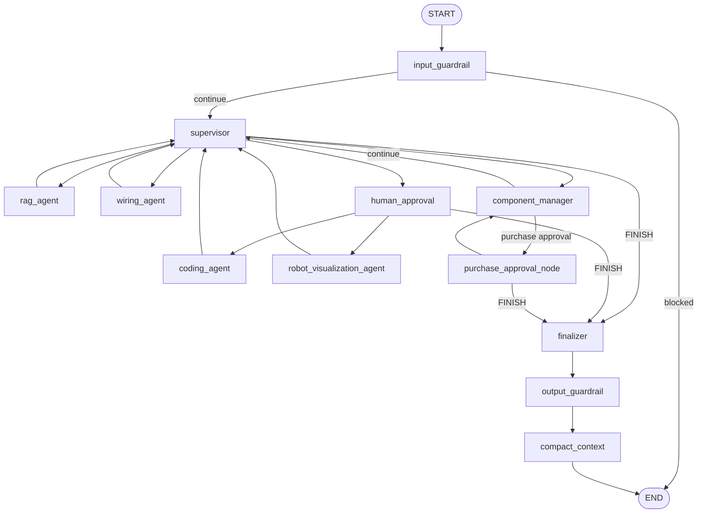

# Robotics Multi-Agent Assistant

A robotics assistant composed of four independently deployable application
services plus Qdrant:

```text
React frontend (:5173)
        |
        v
Agent System A / FastAPI + LangGraph (:8010)
        |----------------------|
        v                      v
Agent System B / ADK       RAG MCP server (:8001)
A2A (:8002), REST (:8003)      |
                               v
                         Qdrant (:6333)
```

## LangGraph workflow

The supervisor routes each request to the appropriate specialist and loops
back until all requested work is complete. Code generation and robot
visualization pass through a human-approval node, while purchases use a
separate purchase-approval path. Input and output guardrails surround the
workflow, and older conversation history is compacted before the turn ends.



The editable Mermaid source is available in
[`docs/architecture/langgraph_workflow.mmd`](docs/architecture/langgraph_workflow.mmd).

## Repository structure

```text
services/
├── agent-system-a/   FastAPI, LangGraph, specialist agents, AP2 and payments
├── agent-system-b/   ADK Component Manager, DigiKey OAuth and ordering
├── mcp-server/       Arduino RAG runtime, corpus assets, snapshot and MCP API
└── frontend/         React, TypeScript and Vite UI
tests/                Backend, graph, payment, MCP and System B tests
evaluation/           Golden datasets, evaluator, dashboard and saved runs
docs/                 Architecture, payment and deployment documentation
docker-compose.yml    Complete local stack
pyproject.toml        Shared Python development and test configuration
```

Runtime databases, generated artifacts, caches, virtual environments,
frontend dependencies and secrets are ignored by Git.

## Prerequisites

- Docker Desktop with Docker Compose
- Node.js 20+ when running the frontend locally
- Python 3.11+ for local tests and evaluation

## Configuration

Create the root environment file and System B environment file:

```bash
cp .env.example .env
cp services/agent-system-b/.env.example services/agent-system-b/.env
```

Fill in the required API keys. Never commit either `.env` file. The current
payment implementation uses Lithic Sandbox:

```env
APP_ENVIRONMENT=development
PAYMENT_PROVIDER=lithic
LITHIC_API_KEY=your_sandbox_key
LITHIC_BASE_URL=https://sandbox.lithic.com/v1
```

DigiKey OAuth secrets remain encrypted inside System B. Payment credentials and
provider references never enter LangGraph state or model-visible messages.

## Start the backend stack

The frontend is normally run locally in this project. Start the backend
services with:

```bash
docker compose up -d --build vector-db mcp-server agent-system-b agent-system-a
docker compose ps
curl http://localhost:8010/health
```

Agent System A is exposed on `http://localhost:8010`. Rebuild only it after a
backend change:

```bash
docker compose up -d --build agent-system-a
```

View logs with:

```bash
docker compose logs -f agent-system-a
```

## Start the frontend locally

```bash
cd services/frontend
npm install
cp .env.example .env.local
npm run dev
```

The frontend should use:

```env
VITE_API_BASE_URL=http://localhost:8010
```

Open `http://localhost:5173`.

## Verification

Run the Python suite from the repository root:

```bash
source .venv/bin/activate
pytest
```

Check and build the frontend:

```bash
cd services/frontend
npm run build
```

Validate Compose without starting containers:

```bash
docker compose config --quiet
```

## Evaluation

Saved agent runs live under `evaluation/runs/`; imported RAG runs live under
`evaluation/rag_runs/`. Both are intentionally retained. Run a new agent
evaluation from the repository root:

```bash
PYTHONPATH=services/agent-system-a:services/agent-system-b \
  .venv/bin/python evaluation/run_evaluation.py --run-name baseline
```

Open the dashboard with:

```bash
.venv/bin/streamlit run evaluation/dashboard.py
```

## Documentation

- [Docker setup](docs/DOCKER_SETUP.md)
- [Lithic/AP2 payment flow](docs/LITHIC_PAYMENT.md)
- [Code walkthrough](docs/CODE_WALKTHROUGH.md)
- [LangGraph workflow](docs/architecture/langgraph_workflow.mmd)
- [Frontend details](services/frontend/README.md)
- [System B details](services/agent-system-b/component_manager/README.md)

## Stop services

```bash
docker compose down
```

Do not add `-v` unless you intentionally want to delete persistent Qdrant,
chat, generated-artifact and System B data volumes.
