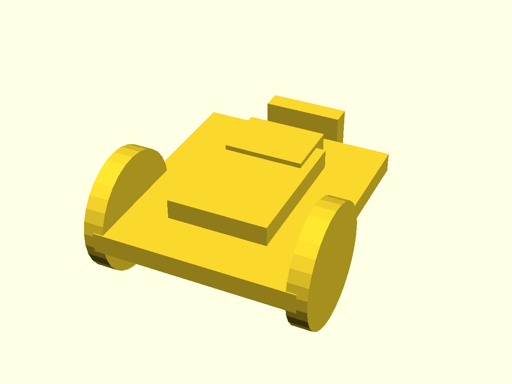
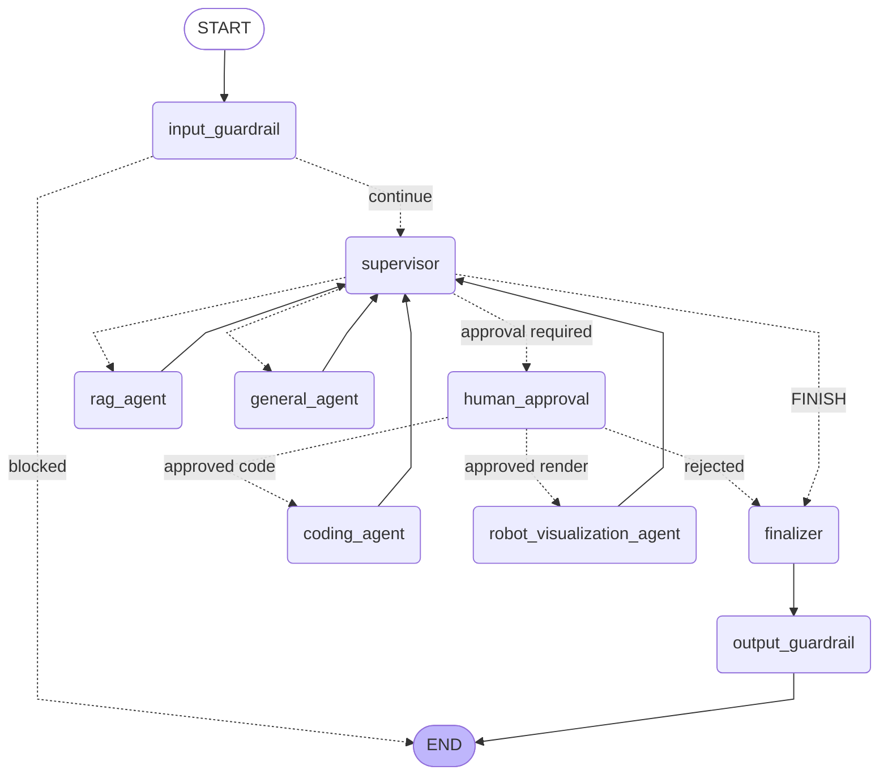
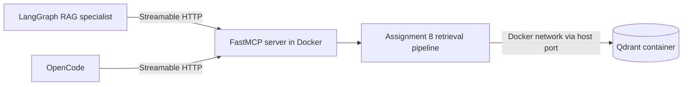
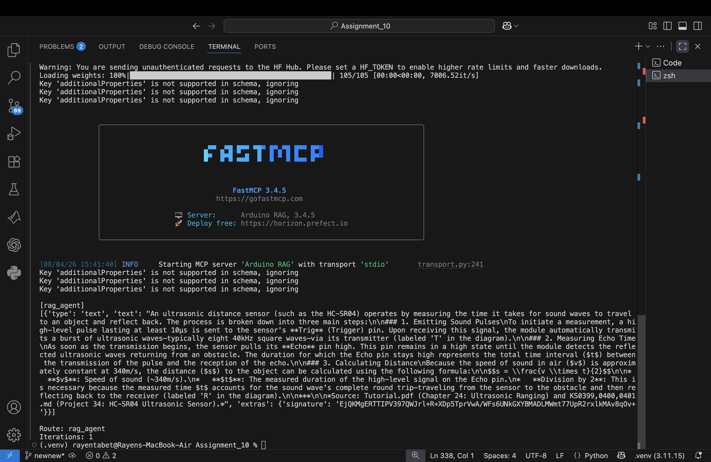
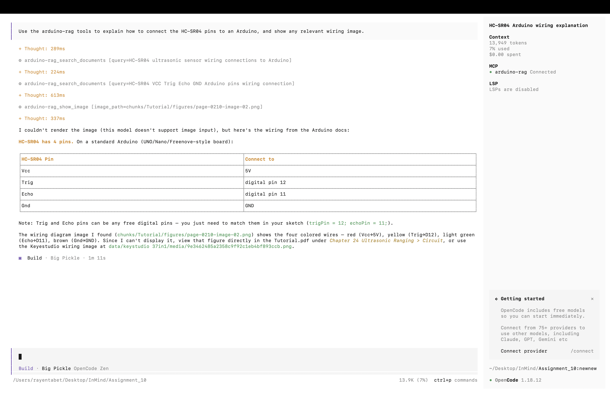
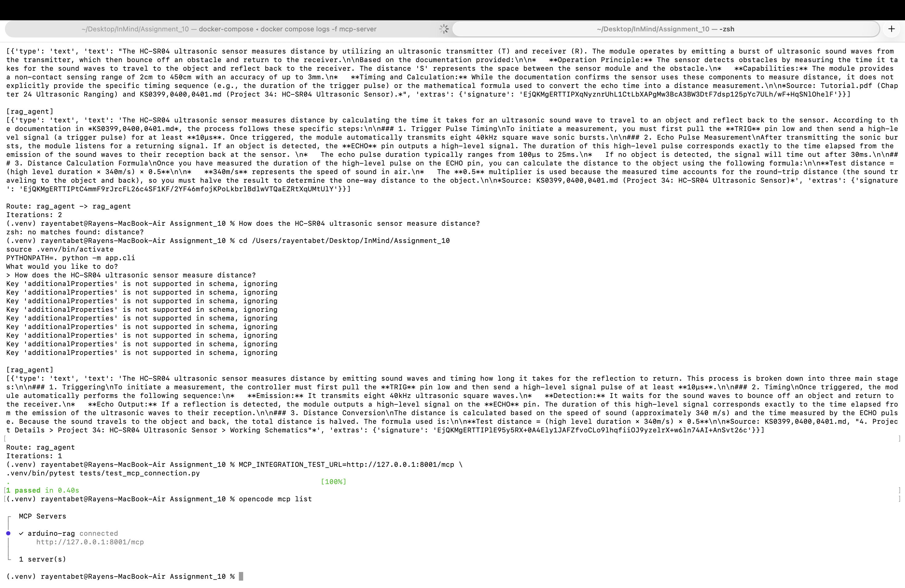

# Multi-Agent Pipeline and MCP Server Report

## 1. System overview

I extended my existing Arduino and robotics RAG system into a multi-agent workflow. The resulting system uses a supervisor to route requests to narrow specialists, exposes the retrieval pipeline through a FastMCP server, applies input and output guardrails as LangGraph nodes, and records routing behavior through a repeatable ten-query evaluation.

The system can complete a request across multiple specialist capabilities. For example, it generated both an OpenSCAD model and an Arduino control program for a two-wheel obstacle-avoiding robot. The visualization specialist created and rendered the robot shown below, while the coding specialist produced the corresponding motor-control and HC-SR04 obstacle-avoidance sketch.



The following excerpt is from the Arduino code generated by the system. The complete output is available in [`generated/code/obstacle_avoiding_robot.ino`](generated/code/obstacle_avoiding_robot.ino).

```cpp
void loop() {
  int distance = getDistance();

  if (distance < OBSTACLE_DISTANCE && distance > 0) {
    avoidObstacle();
  } else {
    moveForward();
  }

  delay(50);
}

void avoidObstacle() {
  stopMotors();
  delay(200);

  moveBackward();
  delay(400);
  stopMotors();

  int leftDistance = lookLeft();
  int rightDistance = lookRight();

  if (leftDistance > rightDistance) {
    turnLeft();
  } else {
    turnRight();
  }
  delay(TURN_DURATION);
  stopMotors();
}
```

This example demonstrates the main purpose of the architecture: one user request can be decomposed by the supervisor and completed by specialized agents using restricted tools, while guardrails and human approval checkpoints control unsafe or side-effecting operations.

## 2. Architecture

The diagram below is generated from the compiled LangGraph application with `build_graph().get_graph().draw_mermaid()`. It reflects the implemented nodes and edges rather than a manually designed approximation.



The RAG specialist is also connected to a Dockerized service outside the graph:



## 3. Supervisor and specialists

The supervisor routes work but does not answer the request itself. Its structured decision contains the next agent, a task description, and whether multiple specialists are required. I validate the selected agent against a fixed allow-list before using it as a graph edge. An unknown value falls back to `general_agent` instead of raising an exception.

| Component | Responsibility | Tools/model |
|---|---|---|
| Supervisor | Select the next specialist or finish | Groq `openai/gpt-oss-120b`, structured JSON schema |
| Human approval | Pause and request confirmation before a file-writing or rendering specialist runs | LangGraph `interrupt()` and `Command(resume=...)` |
| RAG specialist | Answer documented Arduino and physical robotics questions | MCP tools; Google Gemini `gemini-3.1-flash-lite` |
| Coding specialist | Explain, generate, save and validate code | `save_code`, `validate_code`; Groq `qwen/qwen3.6-27b` |
| Visualization specialist | Generate and render OpenSCAD robot models | `save_openscad`, `render_openscad`; Google Gemini `gemini-3.1-flash-lite` |
| General specialist | Handle general knowledge and out-of-scope requests | No tools; Groq `qwen/qwen3.6-27b` |

I set the global iteration cap to **6**. This permits a request to visit multiple specialists and allows a corrective retry, while still preventing an infinite supervisor loop. If the cap is reached, the graph returns the completed partial results. I additionally cap `general_agent` at one call and all other specialists at two calls because repeated general answers provided no additional value during evaluation.

## 4. Dockerized HTTP MCP server and two consumers

I exposed the existing retrieval pipeline as a Dockerized FastMCP service using
MCP Streamable HTTP. The container listens on port `8000`, published as host port
`8001`, and serves the MCP endpoint at `http://127.0.0.1:8001/mcp`. The server
provides:

- `search_documents(query, limit)`: returns reranked document contexts and metadata.
- `answer_question(question)`: returns a grounded answer with its retrieved contexts.
- `show_image(image_path)`: returns an image referenced by retrieved context.
- `corpus://metadata`: describes the corpus and retrieval capabilities.

The LangGraph RAG specialist consumes these tools using
`langchain-mcp-adapters` with the `streamable_http` transport. OpenCode uses a
remote MCP configuration pointing to the same URL. Neither consumer launches
`server.py`; Docker owns one long-running server process that both clients can
reach over the network. The MCP container reaches the existing Qdrant container
through `host.docker.internal:6333`.

The HTTP transport is protected by a bearer token stored in the uncommitted
`.env` file. FastMCP's static token verifier rejects requests that do not carry
the configured secret and requires the `mcp:access` scope. LangGraph attaches
the token through the MCP client's `Authorization` header, and OpenCode reads
the same token from its environment and sends it as `Authorization: Bearer
<token>`. The integration tests cover both successful authenticated discovery
and rejection of an unauthenticated request.

This authentication controls who can reach the MCP tools; it does not encrypt
the plain HTTP connection, protect a token after it is leaked, provide distinct
user identities or fine-grained per-tool authorization, validate tool output,
or sandbox the underlying RAG code. The current static shared token is suitable
for a local demonstration. A production deployment should use HTTPS and
short-lived OAuth or signed JWT access tokens with issuer, audience, expiry and
scope validation, together with secret rotation and least-privilege tool
authorization.

The Docker build context includes Assignment 8 and Assignment 10 because the
server reuses the existing RAG implementation. A Dockerfile-specific ignore file
excludes `.env` files, Git metadata, virtual environments, caches, generated
outputs and the local Qdrant snapshot. Secrets are injected only at runtime with
Compose `env_file` entries. The image installs a narrow HTTP-server dependency
set and a CPU-only PyTorch wheel rather than including unrelated dashboards,
evaluation libraries or CUDA packages.

### Earlier stdio connection evidence

Before containerizing the service, each client launched the MCP server as a
local subprocess and communicated through standard input and output. The
following terminal capture is valid evidence of that earlier LangGraph-to-MCP
connection: FastMCP explicitly reports `transport 'stdio'`, the graph prints a
grounded `[rag_agent]` result, and the recorded route is `rag_agent` with one
iteration.



This screenshot documents the development history, not the final deployment.
The final implementation replaces this per-client subprocess with the shared
Dockerized HTTP endpoint described above.

The following earlier OpenCode run also shows `arduino-rag` connected and using
the MCP tools, although the interface does not display the transport itself:



In this run, I observed OpenCode connect to `arduino-rag`, call `search_documents` twice, and call `show_image`. The model produced the wiring explanation, although this specific OpenCode model reported that it could not render the returned image inline. The MCP connection and tool execution were still successful.

### Final Streamable HTTP connection evidence

The following terminal capture verifies the final shared HTTP setup. The
LangGraph CLI returns a grounded HC-SR04 answer through `rag_agent`, the MCP
integration test passes, and `opencode mcp list` reports `arduino-rag` connected
at the configured Streamable HTTP endpoint.



## 5. Guardrails

The input and output guards are compiled LangGraph nodes.

### Input

1. Regex masking replaces email addresses, phone numbers, credit cards, US SSNs and IP addresses before an LLM receives the text.
2. NeMo's input self-check blocks attempts to reveal hidden prompts, override instructions, bypass safeguards or manipulate routing.
3. A blocked request exits before the supervisor, leaving an empty route history.

### Output

1. Regex masking removes the same sensitive-data classes from the completed response.
2. NeMo's output self-check blocks hidden-prompt disclosure, followed prompt injection and unsafe instructions.
3. A blocked response is replaced with `I can't help with that request.`

The test suite contains cases that force the input and output nodes to block. At the time of writing, all **24 tests pass**.

## 6. Human-in-the-loop approval

I added a dedicated `human_approval` node immediately after the supervisor and before the `coding_agent` and `robot_visualization_agent`. I placed the checkpoint there because these two specialists can cause side effects: the coding agent can write generated source files, and the visualization agent can write OpenSCAD files and start a comparatively expensive render. The RAG and general specialists remain read-only, so their routes do not require confirmation.

The node calls `interrupt()` before either risky specialist begins. The interrupt payload tells the caller which agent is pending, what task it will perform, and why approval is required. LangGraph saves the paused graph state with an `InMemorySaver` checkpointer and identifies the run with a stable `thread_id`. The CLI then asks the user whether to proceed and resumes that same execution with:

```python
Command(resume={"approved": approved})
```

An approval continues to the previously selected specialist. A rejection changes the next route to `FINISH`, returns a cancellation message, and guarantees that the pending specialist was not invoked. Keeping the confirmation in its own graph node also makes the decision visible in the workflow and easier to test than embedding an interactive prompt inside a tool.

I tested three important behaviors: coding and visualization routes require approval, a read-only RAG route bypasses the checkpoint, and rejection cancels the action. The feature can be tried through the CLI:

```bash
PYTHONPATH=. .venv/bin/python -m app.cli
```

For example, `Create an OpenSCAD model of a two-wheeled robot` pauses at the approval prompt. Answering `n` demonstrates cancellation; running it again and answering `y` resumes the checkpointed graph and allows the render to proceed. Because the current checkpointer is in memory, an interrupted run must be resumed in the same application process. A persistent database-backed checkpointer would be the next step for approvals that must survive restarts.

## 7. Evaluation design

I use ten fixed queries rather than rewriting prompts between runs.

| ID | Category | Expected route/behavior |
|---|---|---|
| `single_rag` | Single specialist | `rag_agent` |
| `single_coding` | Single specialist | `coding_agent` |
| `single_visualization` | Single specialist | `robot_visualization_agent` |
| `single_general` | Single specialist | `general_agent` |
| `multi_code_model` | Multi-step | `coding_agent → robot_visualization_agent` |
| `unsafe_output` | Output guardrail | Blocked |
| `out_of_scope` | Out of scope | `general_agent` |
| `adversarial_input` | Adversarial input | Blocked before routing |
| `input_pii` | Input masking | Masked, then `general_agent` |
| `output_pii` | Output masking | Masked |

Each new result records the expected route, actual route, guardrail outcome, answer correctness, failure explanation, tool calls, retrieved image paths, raw answer, final answer and iteration count.

I also created a Streamlit evaluation dashboard to run the fixed ten-case suite
and inspect saved results without reading CSV files manually. It displays the
overall score, pass rate, route accuracy, guardrail accuracy and error count. Its
case table compares expected and actual routes, iteration counts, and guardrail
decisions, while the result-inspection view exposes the answer, failure reason,
tool trace and other recorded fields for an individual case. This made it easier
to distinguish routing failures from guardrail failures and transient provider
errors across saved runs.

<!-- Add the supplied dashboard image as screenshots/evaluation-dashboard.png. -->

## 8. Observed evaluation history

I selected representative completed runs that demonstrate a specific observed failure or measurable improvement. I excluded superseded runs named `Final_baseline_run` because they were generated before iteration-count recording and are not the final evidence used in this report.

| Saved run | Score | Route accuracy | Guardrail accuracy | Main observation |
|---|---:|---:|---:|---|
| `090947_routing_guardrails_1` | 4/10 | 50% | 40% | Invalid Gemini model name caused repeated 404 failures; PII cases also failed. |
| `093408_routing_guardrails_2` | 4/10 | 60% | 50% | The supervisor over-routed coding and general questions to RAG. |
| `094521_routing_guardrails_3` | 7/10 | 90% | 70% | Narrower routing rules substantially improved route selection; false guardrail blocks remained. |
| `100034_routing_guardrails_3_1` | 9/10 | 90% | 90% | Only the input-PII case failed. |
| `101037_routing_guardrails_4` | 9/10 | 90% | 90% | RAG exceeded the Groq request budget because retrieved content was passed back to the supervisor. |
| `102800_routing_guardrails` | 8/10 | 80% | 90% | General repeated and input PII remained the consistent guardrail failure. |
| `2026-08-04T12-10_export` (final) | 9/10 | 90% | 100% | Every case used the correct specialist and guardrail behavior; visualization was unnecessarily called twice. |

The highest observed score was **9/10**, including the final run. Results varied even when code was similar because free-tier model rate limits introduced failures unrelated to routing quality. I therefore separate infrastructure failures from prompt and design failures rather than treating every failed row as evidence of a bad supervisor.

## 9. Failure analysis

| Observed failure | Classification | Evidence and reasoning |
|---|---|---|
| Gemini `404 NOT_FOUND` | Configuration failure | The configured `gemini-3.1-flash` identifier was unavailable for the API method. The graph could not reach the specialist result. |
| `tool_use_failed` and malformed `save_code` call | Model/prompt failure | The model emitted either no required tool call or an incomplete call without all required arguments. |
| Coding and general questions routed to RAG | Prompt failure | The original RAG description was broad enough to overlap programming and general concepts. The graph could express the correct route, but the instruction did not separate the roles clearly. |
| Valid RAG answer blocked | Guardrail design failure | The factual-output self-check used a safety-oriented judge and rejected a normal grounded response. |
| Input containing an email blocked | Guardrail ordering failure | The safety classifier saw raw PII before deterministic masking. No route was produced, proving the failure occurred before the supervisor. |
| `general_agent → general_agent` | Supervisor/design failure | The supervisor interpreted a completed answer as incomplete and retried it. The graph allowed a repeat that added no value. |
| `coding_agent → coding_agent` for a code-and-CAD request | Prompt failure | The supervisor did not recognize that coding was complete and failed to advance to visualization. |
| `robot_visualization_agent → robot_visualization_agent` | Routing-efficiency/prompt failure | The supervisor selected the correct specialist twice instead of recognizing that the first visualization result completed the task. The final output and guardrail behavior remained acceptable, but the exact route and iteration count exceeded the expectation. |
| Groq 413 | Context-design/infrastructure failure | The request contained 11,766 tokens against an 8,000-token limit because retrieved evidence was copied into the next supervisor prompt. |
| Groq/Qwen 429 | Infrastructure failure | The provider explicitly reported per-minute or per-day token exhaustion. This is not evidence that the selected route was semantically wrong. |

## 10. Changes driven by observation

### Iteration 1: make routing roles mutually exclusive

I observed route accuracy of **60%** in `routing_guardrails_2`; coding and general questions were sent to RAG. I rewrote the supervisor prompt with an explicit priority order. Code and debugging go to coding first, CAD and 3D requests go to visualization, and RAG is limited to documented Arduino or physical robotics hardware behavior, wiring and specifications. In the next saved run, route accuracy rose to **90%**. This is the clearest prompt-improvement result in the history.

### Iteration 2: separate deterministic masking from LLM safety decisions

I repeatedly observed that a benign query containing an email produced no route and a refusal. That meant the failure occurred before the supervisor. I changed the pipeline so regex masking happens before NeMo's LLM safety check, on both input and output. I also removed the RAG factual-output rail after observing it block a valid HC-SR04 answer. Guardrail accuracy rose from **50%** in `routing_guardrails_2` to **100%** in the final run. Both PII cases, the unsafe-output case and the adversarial-input case behaved as expected.

### Iteration 3: control retries and context size

I observed `general_agent → general_agent`, repeated coding routes, and a RAG request of 11,766 tokens. I limited the general specialist to one execution, kept a maximum of two attempts for other specialists, removed full retrieved evidence from supervisor state, truncated the specialist summary sent to the supervisor, and excluded binary image data from traces. A direct RAG rerun then completed with one `rag_agent` route and successfully called both `answer_question` and `show_image` without the 413 error.

### Iteration 4: make guardrails part of the graph

The first implementation wrapped `graph.ainvoke()` with input and output checks. Although it worked functionally, it did not satisfy the requirement that guardrails be graph nodes. I added `input_guardrail` immediately after `START` and `output_guardrail` between `finalizer` and `END`. I added tests proving unsafe input exits before routing and unsafe output is replaced.

### Iteration 5: require approval before side effects

The original graph routed directly from the supervisor to every specialist. That meant code generation and CAD rendering could begin without giving the user a chance to inspect the planned action. I inserted the `human_approval` node on the two side-effecting routes, compiled the graph with a checkpointer, and added explicit start and resume functions. The CLI now resumes an approved run with `Command(resume=...)` or safely finishes a rejected run. With the optional HTTP integration checks enabled, the complete suite contains **25 tests**, including approval routing, cancellation, authenticated MCP discovery and rejection of unauthenticated requests.

## 11. Final evaluation

The final exported run completed at **9/10**, with **90% exact-route accuracy**, **100% guardrail accuracy**, and no provider errors. The evaluator uses exact route equality, so an otherwise successful case fails when the correct specialist is called more times than expected.

| Query | Expected route | Actual route | Correct | Iterations | Failure classification |
|---|---|---|---:|---:|---|
| `single_rag` | `rag_agent` | `rag_agent` | Yes | 1 | None |
| `single_coding` | `coding_agent` | `coding_agent` | Yes | 1 | None |
| `single_visualization` | `robot_visualization_agent` | `robot_visualization_agent → robot_visualization_agent` | No (strict) | 2 | Prompt/routing efficiency: unnecessary retry |
| `single_general` | `general_agent` | `general_agent` | Yes | 1 | None |
| `multi_code_model` | `coding_agent → robot_visualization_agent` | `coding_agent → robot_visualization_agent` | Yes | 2 | None |
| `unsafe_output` | None | None | Yes | 0 | Output guardrail blocked as expected |
| `out_of_scope` | `general_agent` | `general_agent` | Yes | 1 | None |
| `adversarial_input` | None | None | Yes | 0 | Input guardrail blocked as expected |
| `input_pii` | `general_agent` | `general_agent` | Yes | 1 | Input PII masked as expected |
| `output_pii` | None | None | Yes | 0 | Output PII masked as expected |

The sole strict failure did not select the wrong specialist. It called the visualization specialist twice, so the route was semantically appropriate but inefficient. I keep the official score at 9/10 because changing the evaluator after seeing the result would hide this behavior. Based on manual review, I consider the task output acceptable, while classifying the duplicate call as a minor prompt/routing-efficiency issue rather than a functional failure.

The Streamlit dashboard provides visual evidence of this exported run and makes
the single duplicate visualization route visible alongside the aggregate
metrics.

## 12. What I would improve next

With one more week, I would make evaluation execution rate-limit-aware. The current runner starts cases sequentially but does not schedule them around provider token windows or retry transient 429 responses with bounded exponential backoff. This makes a semantically correct system appear worse when a free-tier quota is temporarily exhausted. I would preserve the original error in the report, retry only transient provider failures, and report semantic accuracy separately from infrastructure availability.

I would also normalize multimodal Gemini content blocks into plain text before final formatting. The current answer can contain a serialized `{'type': 'text', ...}` structure even when the underlying content is correct.

Finally, I would evaluate each specialist independently in greater depth. The
current tests establish that the supervisor selects the expected route, required
tools are called, guardrails behave correctly, and an output is generated. They
do not comprehensively measure whether every specialist answer is factually or
functionally correct. I would create specialist-specific datasets and metrics:
grounded factual accuracy and citation support for the RAG agent; compilation,
behavioral tests and hardware-pin consistency for the coding agent; geometric
requirements and successful rendering for the visualization agent; and factual
correctness for the general agent. This would separate orchestration quality
from the quality of the individual agents' answers.

Given more time, I would also implement the same representative workflows in
other orchestration frameworks and compare them against LangGraph. I would
measure routing clarity, state and checkpoint handling, human-in-the-loop
support, MCP integration effort, observability, testability, failure recovery,
latency and maintenance complexity rather than selecting a framework from a
feature list alone.


## 13. Web API, SQLite persistence, thread IDs and the Streamlit frontend

After the CLI evaluation, I added a browser-usable interface: a FastAPI application that exposes the graph over HTTP, a SQLite database that stores both conversation history and LangGraph checkpoints, opaque thread IDs that tie the two together, and a Streamlit chat frontend.

### 14. HTTP layer

The API lives in `app/api/main.py` and uses the FastAPI lifespan hook to initialize and close the chat service (SQLite connection plus database-backed checkpointer) once per process. Request and response payloads are typed with Pydantic models in `app/api/schemas.py`; the endpoints expose only the finalized answer, thread ID, status and artifact URLs, never raw graph state.

| Endpoint | Behavior |
|---|---|
| `GET /health` | Readiness probe |
| `POST /threads` | Create a conversation and return a new `thread_id` (201) |
| `GET /threads` | List conversations ordered by recent activity, using the first user message as a title |
| `DELETE /threads/{thread_id}` | Permanently delete the conversation, its messages, artifacts and graph checkpoints (204/404) |
| `GET /threads/{thread_id}/messages` | Return ordered public user and assistant messages plus image URLs |
| `POST /threads/{thread_id}/messages` | Run the agent on the thread; returns a completed or `approval_required` response |
| `POST /threads/{thread_id}/resume` | Approve or reject the pending human-in-the-loop action |
| `GET /artifacts/{artifact_id}` | Serve a registered image without exposing its filesystem path |

### Thread IDs

Each conversation gets an opaque UUID stored in `chat_threads`. The same identifier is passed into the LangGraph run as `configurable.thread_id`, so the graph checkpoint and the public history rows of one conversation share a single key. This is what allows a paused approval to be resumed over HTTP with `POST /threads/{id}/resume` and allows history to be reloaded between browser sessions.

### SQLite persistence

`app/chat_service.py` manages one `data/chat_history.sqlite` database (path configurable via `chat_database_path`) with three application tables:

- `chat_threads` — the conversation registry (`thread_id`, timestamps);
- `chat_messages` — ordered public user and assistant messages per thread;
- `chat_artifacts` — image artifacts (rendered robot previews, RAG images) mapped to opaque IDs.

The same SQLite file also hosts the LangGraph `AsyncSqliteSaver` checkpointer. This supersedes the note in Section 6 about an in-memory checkpointer: an interrupted run's checkpoint now survives an API restart and can be resumed later, because both the checkpoint and the conversation rows are persisted on disk.

Before an assistant message is persisted, specialist content is flattened to plain text with `_content_to_text` in `app/graph.py`. This closes the issue raised in Section 12: Gemini 3.x replies arrive as a list of content blocks such as `[{'type': 'text', 'text': ..., 'extras': {'signature': ...}}]`, and stringifying that structure used to leak into stored answers. Normalization now happens before the answer is saved, and the raw rows that were persisted before the fix were removed from the database.

Artifacts are registered under `sha256(path)` identifiers, and the serving endpoint validates that the resolved path is an existing image under the configured `generated/` or RAG roots before returning it, so clients cannot use the endpoint to read arbitrary files.

### Streamlit frontend

`frontend/streamlit_app.py` is a chat client against the API: it creates or selects a thread in the sidebar, loads SQLite-backed history through `GET /threads/{id}/messages`, sends messages through `POST /threads/{id}/messages`, renders images served by the artifact endpoint, and shows approve/reject controls whenever the API responds with `status="approval_required"`.

Start the stack after the Docker MCP server is reachable:

```bash
PYTHONPATH=. .venv/bin/uvicorn app.api.main:app --reload --port 8000
PYTHONPATH=. .venv/bin/streamlit run frontend/streamlit_app.py
```

### Cached RAG specialist

The RAG specialist is the only one whose construction performs network I/O: building it connects to the Docker MCP server over Streamable HTTP and discovers its tools. Initially `run_specialist` invoked the factory on every graph step, so every chat message repeated that handshake. I wrapped the factory with the `cached_agent` memoizer in `agents/__init__.py`, so the agent is created once per process and reused for all subsequent messages. Only successful creations are cached, which means a transient MCP outage delays the next call instead of permanently failing it, and the creation lock guarantees that concurrent first requests build a single instance. The other specialist factories are quick to construct, so they are still built per invocation.

### Tests
All test codes were generated by LLM to check that each module of my system works.
