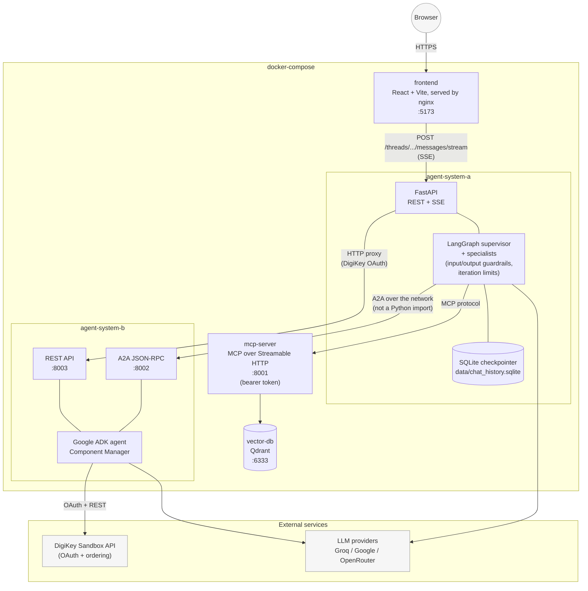

# System architecture

This diagram shows the full deployed topology — five containers plus
external services. It complements, and does not replace,
[`langgraph_workflow.svg`](langgraph_workflow.svg), which shows only the
internal node graph *inside* `agent-system-a`.

## Notes

- **Network boundary, not a function call.** `agent-system-a` never imports
  `agent-system-b`'s Python package. All communication crosses the network:
  the core purchasing/inventory flow goes over A2A JSON-RPC (`:8002`); the
  DigiKey OAuth flow proxies over System B's own REST API (`:8003`).
- **Both systems expose SSE.** `agent-system-a`'s `/threads/{id}/messages/stream`
  streams LangGraph node-level progress (routing decisions, tool calls) as
  each specialist runs. `agent-system-b`'s own REST API independently streams
  token/tool events from its ADK agent.
- **Session state** lives in `agent-system-a`'s SQLite checkpointer
  (LangGraph `AsyncSqliteSaver`), keyed by `thread_id`, so conversation
  history and paused approvals survive across requests and restarts.
- **Guardrails** (NeMo Guardrails input/output rails) and **iteration
  limits** run as real graph nodes inside `agent-system-a`, not as
  middleware — see `langgraph_workflow.svg` for exactly where in the flow.
