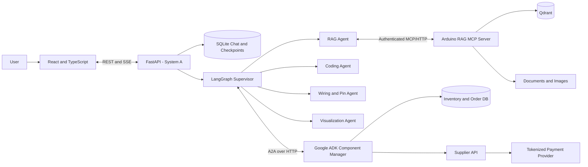
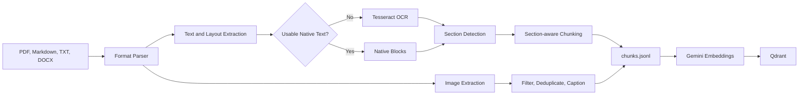

# Final Project Proposal

## Intelligent Robotics Design and Component Planning Assistant

**Student:** Rayen Tabet  
**Course:** InMind Academy — Final Project  
**Stack:** Python, LangGraph, Google ADK, A2A, FastAPI, React, TypeScript, MCP, Qdrant, SQLite, Docker

---

## 1. Executive Summary

This project proposes a multi-agent assistant for Arduino robotics design. From a natural-language request, the system will retrieve grounded technical information, select components, check inventory and prices, prepare controlled purchases, allocate compatible pins, generate and validate Arduino code, produce wiring instructions, and create an OpenSCAD robot preview.

The solution contains two independent agent systems:

- **System A — Robotics Design System:** a Python/LangGraph application containing the supervisor, RAG, coding, wiring, and visualization agents.
- **System B — Component Manager:** an independent Google ADK agent that manages inventory, supplier offers, purchase proposals, and approved orders.

System A communicates with the Component Manager through Agent-to-Agent (A2A) over HTTP. The RAG is exposed through an authenticated Model Context Protocol (MCP) server and uses Qdrant for vector retrieval. FastAPI provides the application boundary, React provides the interface, and SQLite persists conversations, checkpoints, inventory, and order records.

---

## 2. Problem Statement

Designing an Arduino robot requires information from datasheets, tutorials, wiring diagrams, supplier catalogs, and inventory records. The designer must select compatible components, avoid pin conflicts, produce consistent code and wiring, and verify component availability. General language models can hallucinate technical specifications and cannot reliably access private inventory or current supplier data without tools.

The proposed system addresses this through document-grounded RAG, specialized agents, deterministic engineering tools, independent A2A services, persistent conversations, approvals, and evaluation.

---

## 3. System Architecture

### 3.1 Model allocation

| Part | Model | Purpose |
|---|---|---|
| Supervisor | `openai/gpt-oss-120b` | Structured routing and task coordination |
| Guardrails | `openai/gpt-oss-safeguard-20b` | Safety and sensitive-content classification |
| RAG Agent | `gemini-3.1-flash-lite` | MCP tool use and grounded answers |
| Query analyzer | `gemini-3.1-flash-lite` | Technical multi-query generation |
| Image captioning | `gemini-3.1-flash-lite` | Diagram and component description |
| Grounded generator | `gemini-3.1-flash-lite` | Evidence-only answer generation |
| Embeddings | `gemini-embedding-2`, 768 dimensions | Dense document representation |
| Reranker | `cross-encoder/ms-marco-MiniLM-L6-v2` | Query-context relevance scoring |
| Coding Agent | `qwen/qwen3.6-27b` | Arduino code generation and debugging |
| Wiring Agent | `qwen/qwen3.6-27b` | Constraint interpretation and tool calls |
| Visualization Agent | `gemini-3.1-flash-lite` | OpenSCAD generation |
| Component Manager | `gemini-3.1-flash-lite` | Inventory and purchasing orchestration |

Models interpret requests and select tools. Deterministic code enforces database, electrical, filesystem, approval, and financial rules.

The deployment contains five runtime services: React, FastAPI/LangGraph,
the RAG MCP server, the Google ADK Component Manager, and Qdrant. SQLite is
internal storage owned separately by Systems A and B, not another service.

---

## 4. System A: LangGraph Robotics Design System

### 4.1 Supervisor Agent

The supervisor routes requests, coordinates multi-agent tasks, manages approvals and retries, and assembles the final response. It has no tools; routing, checkpoints, limits, and workflow completion are LangGraph nodes and conditional edges.

All specialists update one shared `ProjectPlan` containing the board,
components, wiring, code artifact, model artifact, and purchase state. This
keeps code, wiring, visualization, and procurement consistent.

### 4.2 RAG Agent

Answers Arduino and robotics questions using indexed evidence.

Tools:

- **`answer_question`** — generates an evidence-grounded answer.
- **`show_image`** — returns a relevant diagram, pinout, or technical figure.

### 4.3 Coding Agent

Generates, explains, debugs, stores, and validates Arduino or supporting code.

Tools:

- **`save_code`** — writes approved code to the restricted generated-code directory.
- **`validate_code`** — applies file, syntax, and project validation rules.

### 4.4 Wiring and Pin Management Agent

Converts the selected board and components into a consistent pin assignment and wiring plan.

Tools:

- **`get_board`** — returns digital, analog, PWM, UART, I²C, SPI, power, and reserved pins.
- **`get_component`** — returns voltage, interface, signal, and pin requirements.
- **`allocate_pins`** — assigns compatible and unused pins.
- **`validate_wiring`** — detects conflicts, missing connections, and incompatible interfaces.
- **`format_wiring_plan`** — produces structured data and a readable wiring table.

Pin allocation and validation are deterministic. Their output is shared with the Coding and Visualization Agents so all artifacts use the same connections.

### 4.5 Robot Visualization Agent

Creates OpenSCAD robot models and rendered previews.

Tools:

- **`save_openscad`** — stores approved OpenSCAD code in the generated-model directory.
- **`render_openscad`** — renders the model and registers its preview as an artifact.

---

## 5. System B: Google ADK Component Manager

The Component Manager is an independent Google ADK application with its own model, tools, API, and database. System A cannot read its database directly.

Tools:

- **`check_component_availability`** — returns inventory quantity, reservations, location, and status.
- **`search_digikey`** — searches Product Information V4 and returns ranked, in-stock product cards.
- **`create_digikey_proposal`** — refreshes an exact offer and prepares signed AP2 approval evidence.
- **`place_digikey_order`** — submits the exact approved proposal once to DigiKey Sandbox.
- **`get_digikey_order`** — retrieves the locally recorded sandbox order reference and state.

### 5.1 Purchasing and A2A workflow

System B publishes an A2A Agent Card describing its skills and message formats. System A discovers the card and sends structured component tasks over HTTP. System B checks inventory and, when stock is insufficient, searches DigiKey and returns a purchase proposal for an exact part.

React displays the immutable proposal, including the exact part, quantity, supplier, currency, fees, total, delivery information, and expiration. The workflow pauses until the user approves or rejects it. Approval is bound to the proposal ID and total; any change creates a new proposal. System A then sends only the approved proposal reference through A2A, and the deterministic purchasing tool submits it once using an idempotency key.

Ordering remains hard-limited to DigiKey Sandbox. Three-legged OAuth credentials and encrypted tokens remain outside model context, browser state, A2A messages, source code, and logs. AP2 intent, checkout, and payment mandates bind the exact cart to explicit human approval. System B stores proposals, order IDs, timestamps, totals, mandates, and supplier responses as an audit trail.

---

## 6. RAG Architecture

### 6.1 Ingested documents

| Source | Format | Length | Content |
|---|---|---:|---|
| `Tutorial.pdf` | PDF | 229 pages | Projects, components, wiring, code, and results |
| `arduino-datasheet.pdf` | PDF | 15 pages | Arduino specifications |
| `arduino-pinout.pdf` | PDF | 5 pages | Board pinout and interface diagram |
| `KS0399,0400,0401.md` | Markdown/media | 2,672 lines | Keyestudio 37-in-1 kit documentation |

The ingestion pipeline also supports TXT and DOCX.

### 6.2 Ingestion pipeline

Format-specific processing:

- **PDF:** PyMuPDF extracts ordered blocks, fonts, bounding boxes, bookmarks, pages, and figures. Repeated headers, footers, and page numbers are removed. Pages with fewer than 30 usable characters are rendered at 2× scale and processed with Tesseract OCR.
- **Markdown:** headings and short bold labels form hierarchical sections; linked images are attached to their parent text.
- **TXT:** content is normalized into a document chunk.
- **DOCX:** heading styles define sections and embedded media are extracted.

Each chunk contains a stable ID, modality, content, source document, source location, and relevant page and image metadata. PDF bookmarks define hierarchy; otherwise headings are inferred from font size, bold text, numbering, and punctuation. Chunks never cross project boundaries.

### 6.3 Chunking and images

The structure-aware chunker uses:

- target size: **700 estimated tokens**;
- hard maximum: **950 tokens**;
- overlap: up to **100 tokens**;
- sentence/word splitting for oversized paragraphs; and
- repeated section paths plus page, section, part, and image metadata.

PDF figures are linked by section and page range. Small, decorative, or duplicate images are removed using dimensions and SHA-256 hashes. `gemini-3.1-flash-lite` captions useful technical images, including visible pins, labels, connections, and dimensions. Captions become searchable text linked to the source image and parent chunk. Explicit document text takes priority over generated captions.

### 6.4 Embeddings and Qdrant

`gemini-embedding-2` converts text into **768-dimensional** vectors. Requests are batched in groups of 20 with rate limiting and retry handling. Deterministic UUID v5 point IDs make indexing idempotent.

Qdrant uses **cosine similarity** and modality filtering. Its payload stores chunk ID, text, source, section, pages, content type, and linked image paths.

### 6.5 Retrieval and generation

1. `gemini-3.1-flash-lite` produces up to three technical query variants while preserving board names, part numbers, pins, voltages, and protocols.
2. Qdrant dense search and BM25 lexical search each retrieve at least 20 candidates.
3. Reciprocal Rank Fusion combines rankings using `1 / (60 + rank)`.
4. At least 30 fused candidates are reranked by `cross-encoder/ms-marco-MiniLM-L6-v2`.
5. The five highest results are passed to `gemini-3.1-flash-lite` for grounded generation.

The generation prompt permits only retrieved evidence, prioritizes authoritative text over captions, and requires an “unknown” response when evidence is missing. The response contains the answer, sources, locations, and optional images. Images are exposed to React through opaque artifact URLs rather than filesystem paths.

The RAG will be evaluated using faithfulness, answer relevancy, context precision, context recall, Recall@5, Precision@5, Mean Reciprocal Rank, and latency.

---

## 7. MCP Integration

The RAG is exposed as an authenticated FastMCP Streamable HTTP service. The
production RAG Agent receives only `answer_question` and `show_image`.
`search_documents` remains available for evaluation and debugging:

- `search_documents(query, limit)` — evaluation/debug retrieval and metadata;
- `answer_question(question)` — grounded answer and contexts;
- `show_image(image_path)` — validated technical image; and
- `corpus://metadata` — corpus and retrieval capabilities.

The MCP boundary keeps retrieval independent and reusable. Bearer authentication protects tool discovery and calls, while image access is restricted to approved files within the RAG root.

---

## 8. Conversation and Interface

FastAPI creates a UUID for each conversation. SQLite stores public messages, artifacts, and LangGraph checkpoints so users can list, select, resume, and delete chats. System B separately retains inventory and financial audit records; deleting a chat does not delete or cancel an order.

The React/TypeScript frontend uses Vite, TanStack Query, and browser `EventSource`. It contains:

- a sidebar for conversation management;
- a chat panel for messages, approvals, errors, and images; and
- an activity panel for sources, tool progress, wiring, inventory, and orders.

Server-Sent Events report safe operational states such as agent/tool activity, approval requests, purchase proposals, order updates, artifacts, answer tokens, completion, and errors. They never expose chain-of-thought. React communicates only with FastAPI, never directly with databases, MCP, A2A, suppliers, or payment systems.

---

## 9. End-to-End Workflow

1. React sends a message using a new or existing thread ID; FastAPI persists it and invokes LangGraph.
2. Guardrails inspect the input, then the supervisor routes each required task.
3. The RAG Agent retrieves technical evidence through MCP.
4. System A asks the Component Manager through A2A to check inventory and prepare supplier proposals for missing parts.
5. React requests approval for a purchase; after approval, System B submits it once and returns its status.
6. The Wiring Agent creates a validated pin plan used by the Coding and Visualization Agents; controlled file operations require approval.
7. The supervisor combines completed results into the public response.
8. React displays the answer, sources, wiring table, component/order status, code artifacts, and images; SQLite preserves the conversation.

---

## 10. Guardrails

Safety classification uses `openai/gpt-oss-safeguard-20b`, supported by deterministic validation.

- Block unsafe requests and prompt injection.
- Mask secrets and payment information.
- Return final answers without private reasoning.
- Use parameterized SQL through approved tools only.
- Restrict generated code and files to approved directories.
- Require approval before file writing, rendering, substitutions, and purchases.
- Validate pins, protocols, and voltage constraints.
- Enforce purchase totals, expiration, and spending limits.
- Prevent duplicate orders with idempotency keys.
- Validate MCP, A2A, and API schemas.
- Apply timeouts, bounded retries, and iteration limits.
- Sanitize logs and hide internal paths.

---

## 11. Evaluation

The evaluation will cover:

- RAG faithfulness, relevancy, retrieval precision/recall, ranking, and latency;
- supervisor routing and multi-agent completion accuracy;
- tool selection and structured argument correctness;
- pin-conflict detection and code-to-wiring consistency;
- inventory, price, proposal-total, and currency correctness;
- approval, expiration, spending-limit, idempotency, status, and cancellation behavior;
- A2A/MCP success and recovery from malformed responses or timeouts;
- chat persistence, checkpoint resume, artifacts, and authentication; and
- end-to-end completion time.

Evaluation runs will save their configuration and results to support reproducible comparison.

---

## 12. Conclusion

The proposed system combines grounded retrieval, deterministic engineering tools, persistent conversations, controlled procurement, and cross-framework agent collaboration. LangGraph coordinates robotics design in System A, while Google ADK independently manages components and orders in System B through A2A. MCP separates the RAG as a reusable service. The result is a traceable robotics assistant that can move from a user request to documented technical guidance, available components, validated wiring, consistent code, visual artifacts, and explicitly approved purchases.
